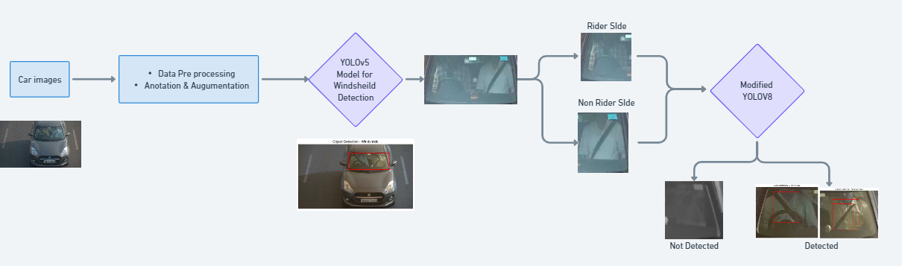
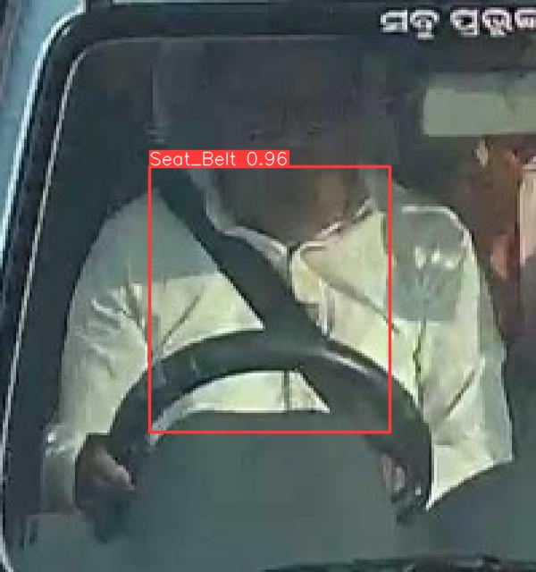
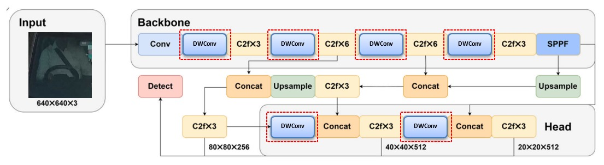

# Seat Belt Detection Using YOLOv8

This repository provides a comprehensive solution for seat belt detection using the YOLOv8 deep learning model. The project demonstrates the application of advanced computer vision techniques for safety systems, aimed at identifying whether a seat belt is worn or not in vehicles.



## *Abstract*

Road safety is a critical global concern, with non-compliance to seat belt usage significantly contributing to road accidents. In this study, we propose an intelligent, lightweight seat belt detection model utilizing depthwise separable convolutions, referred to as *DW-YOLOv8*. A comprehensive dataset of vehicle interior images was collected and annotated, specifically designed to address the lack of existing datasets for Indian traffic conditions. This dataset, gathered from diverse locations in Odisha, India, encompasses varying seating positions, lighting conditions, and seat belt usage scenarios. 

The *YOLOv5* model has been employed for windshield detection, while a *DW-YOLOv8* model, featuring depthwise separable convolutions and a ReLU activation function, was developed for seat belt detection. The proposed model achieved an accuracy of *92.1%* on the test dataset, demonstrating strong performance metrics such as precision and recall. With a compact model size of *2.4 MB* and rapid inference speeds of *4.9 ms* per image on GPU and *215 ms* on CPU, our model shows promise in improving safety assessments and enforcing seat belt compliance, particularly in developing countries like India.



### Additional Information:
- *Dataset Source*: The dataset was collected from a government-bound agency and can be shared upon request.
- *Data Annotation & Preprocessing: All images were annotated and preprocessed using **ROBOflow*.
- *Custom YOLO Model: We made modifications to the **Ultralytics YOLO* module, building a custom YOLO model optimized for seat belt detection.

## *Folder Structure*

The repository is organized into several folders and files, each serving a distinct purpose. Below is an overview of the folder structure:


Seat-Belt-Detection/
│
├── **Code/**  
│   Contains the main code files for model training, evaluation, and inference.  
│   - `train_yolov8t_SeatBelt.ipynb`: Notebook for training the YOLOv8 model on the seat belt dataset.  
│   - `SeatBelt_YOLO_Pipeline.ipynb`: Pipeline for detecting seat belts.  
│   - `Test_mAP_All_Runs.ipynb`: Notebook to evaluate mean average precision (mAP) on different runs.  
│   - `rcnntrail2.ipynb`: Experiment notebook for testing other detection algorithms.
│   
├── **RUN_DW_Conv/**  
│   Contains training results and configurations for the YOLOv8 model with depth-wise convolution (DWConv) architecture.  
│   - Results and weights for training YOLOv8 with optimized DWConv settings.
│   
├── **Config/**  
│   Contains YAML configuration files for different YOLOv8 models and hyperparameter settings.  
│   - `custom (2).yaml`: Configuration for standard YOLOv8 model.  
│   - `customyolov8n (1).yaml`: Configuration for YOLOv8 with depth-wise convolution (DWConv).
│   
├── **Images/**  
│   Contains images used for visualization, detection results, and architectural diagrams.  
│   - `DWconv (1).jpeg`: Depth-wise convolution architecture.  
│   - `all_data.jpeg`: Custom collected dataset.  
│   - `seatbeltimage (1).jpeg`: Cropped region for seat belt detection.  
│   - `seatbletdetection (1).jpeg`: Model inference result showing detected seat belt.
│   
├── **Weights/**  
│   Contains the pretrained and trained YOLOv8 model weights.  
│   - `seatbeltWbest (1).pt`: Best performing YOLOv8 weights for seat belt detection.
│   - `windsheildWbest (2).pt`: Best performing YOLOv8 weights for windshield detection.
│   
├── **LICENSE/**  
│   Contains the project's licensing information.
│   
├── **requirements.txt**  
│   Lists the Python dependencies required to run the project.
│   
└── **README.md**  
    The README file you are currently reading.

### *DWYOLOv8 Architecture*


### *Training and Inference*

### *Training the Model*
To train the model, navigate to the Code/ directory and run the following notebook:

```bash
train_yolov8t_SeatBelt.ipynb
```

You can modify the configuration files in the Config/ folder to adjust training parameters such as batch size, epochs, and learning rate.

### *Running Inference*
After training, you can use the pretrained weights in the Weights/ folder for inference. Use the following code to load a model and run predictions:

```python
from ultralytics import YOLO
model = YOLO('weights/seatbeltWbest (1).pt')
results = model('test_image.jpg')
results.show()  # To display the predicted image
```


## *Contact*

For any queries, contributions, or feedback, please feel free to contact the authors:

- *Prasanta Kumar Nayak*  
  Department of Computer Science and Engineering  
  National Institute of Technology Rourkela, Odisha, India  
  Email: [919CS5013@nitrkl.ac.in](mailto:919CS5013@nitrkl.ac.in)

- *Prof. Ratnakar Das*  
  Department of Computer Science and Engineering  
  National Institute of Technology Rourkela, Odisha, India  
  Email: [ratnakardas@nitrkl.ac.in](mailto:ratnakardas@nitrkl.ac.in)

- *Kondepudi Venkata Durga*
  Email: [venkatdurgakondepudi@gmail.com](mailto:venkatdurgakondepudi@gmail.com)
  
- *K Rahul*
  Email: [korkanarahul@gmail.com](mailto:korkanarahul@gmail.com)
  
## *References*

1. Zhou, Qirui, Dandan Liu, and Kang An. "ESE-YOLOv8: A Novel Object Detection Algorithm for Safety Belt Detection during Working at Heights." Entropy 26.7 (2024): 591.
2. Upadhyay, Anand, Bhavesh Sutrave, and Abhishek Singh. "Real-time seatbelt detection using YOLO deep learning model." 2023 IEEE International Students' Conference on Electrical, Electronics and Computer Science (SCEECS). IEEE, 2023.
3. Qiu, Liankui, Jiankun Rao, and Xiangzhe Zhao. "Seatbelt Detection Algorithm Improved with Lightweight Approach and Attention Mechanism." Applied Sciences 14.8 (2024): 3346.
4. Zang, Ying, Bo Yu, and Shuguang Zhao. "Lightweight seatbelt detection algorithm for mobile devices." Multimedia Tools and Applications 82.16 (2023): 24505-24519.
5. Gao, H., B. Cheng, J. Wang, K. Li, J. Zhao, and D. Li, "Object Classification Using CNN-Based Fusion of Vision and LIDAR in Autonomous Vehicle Environment," IEEE Transactions on Industrial Informatics, vol. 14, no. 9, pp. 4224-4231, Sept. 2018.

## *License*

This project is licensed under the [MIT License](LICENSE).
